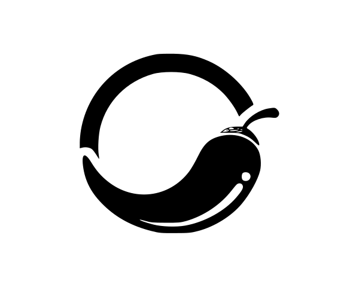
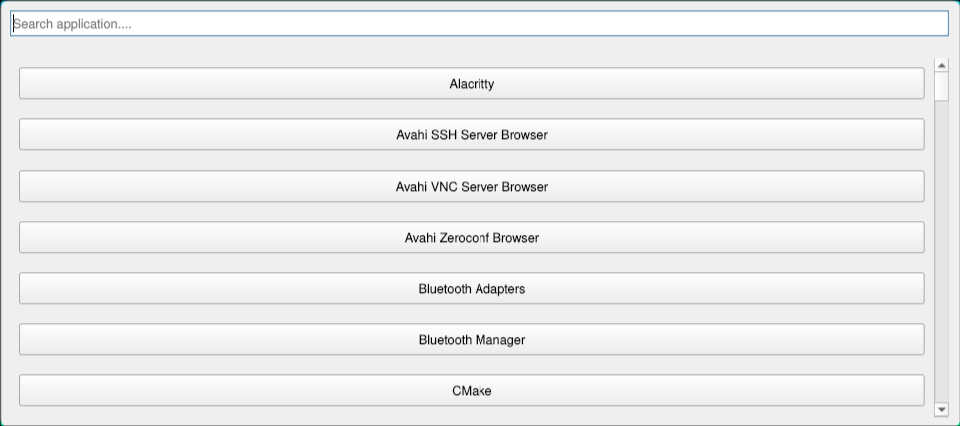
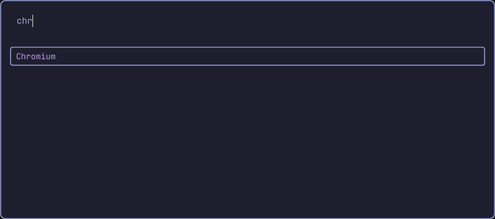
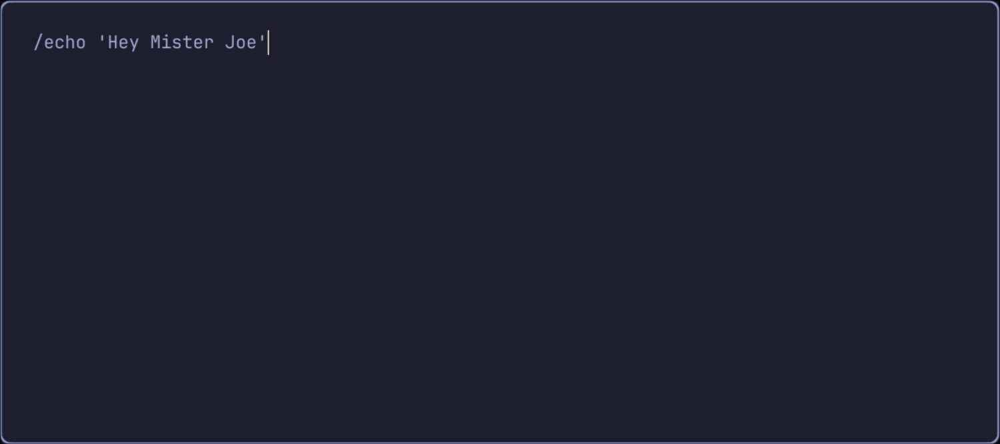
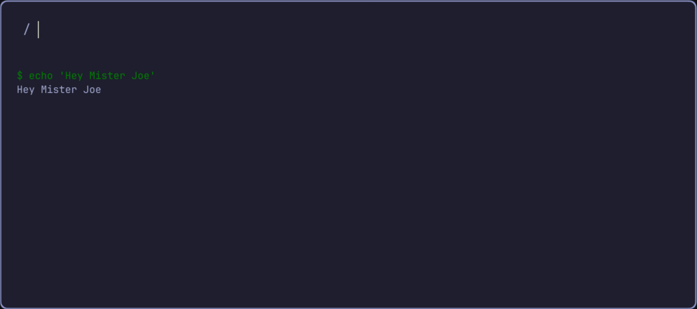
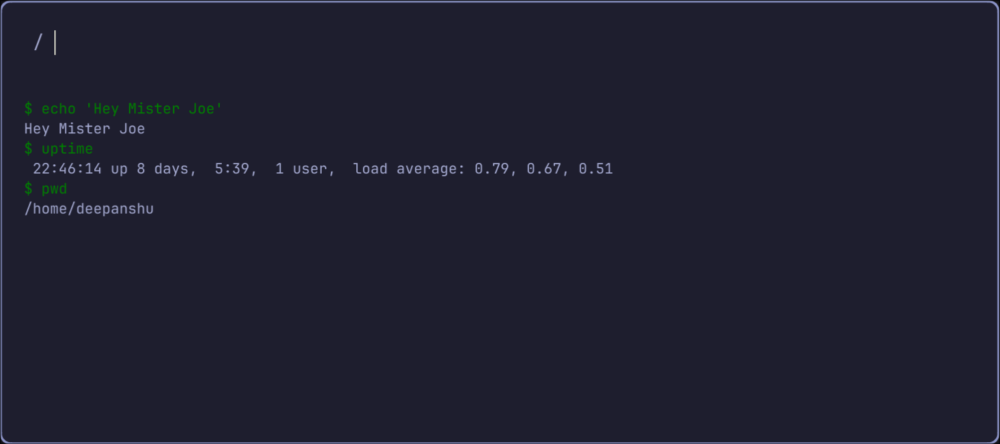
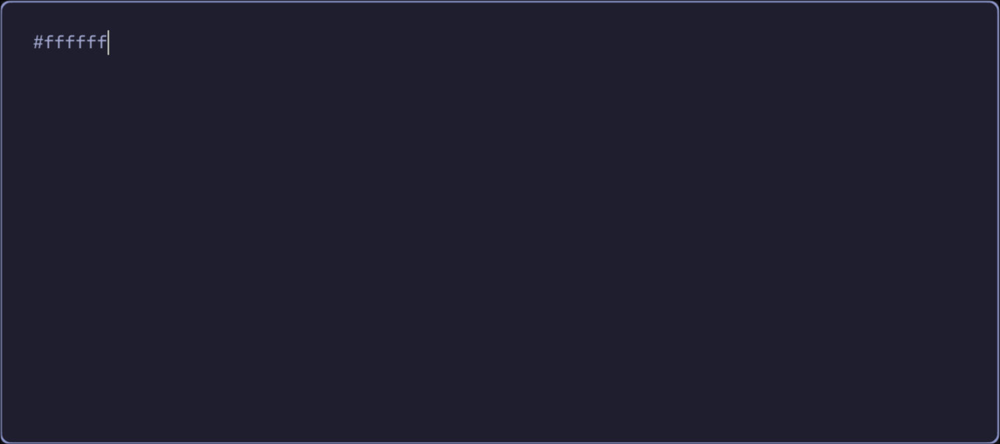
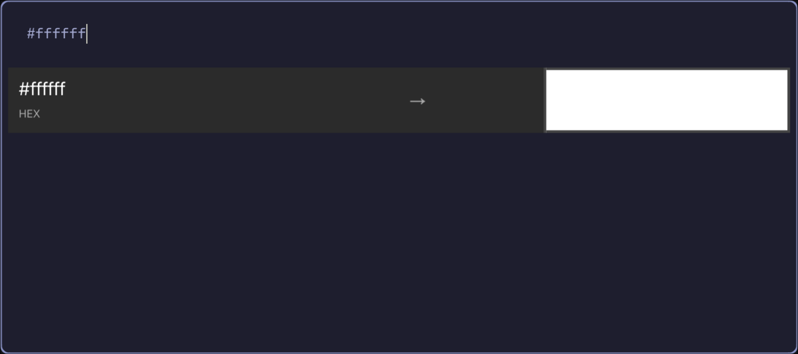
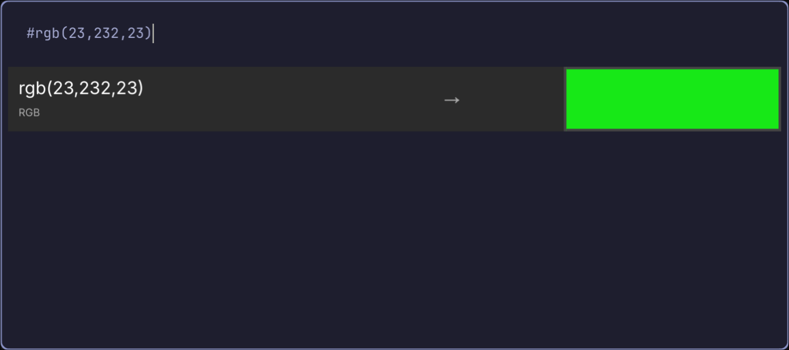
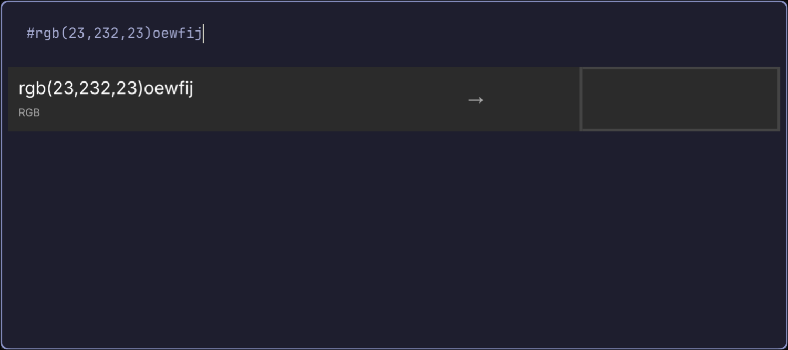

# Peppy


Peppy is a light-weight, keyboard-driven, **cross platform application launcher** desinged for **Linux** and **macOS**. \
Inspired by [Raycast](https://github.com/raycast) and [Wofi](https://github.com/SimplyCEO/wofi). \
Built with performance and simplicity in mind, Peppy offers a fast way to open **GUI application** from a beautiful and minimal interface.

## Demo
https://github.com/user-attachments/assets/588bcf6a-d648-4b8e-a3cc-66e80afe3256


## Features
- ⚡ **Lightning-fast fuzzy search** for installed apps
- ⌨️ **Full keyboard navigation** – `Enter`, `Esc`, `↑ ↓`, `Ctrl+C`, etc.
- 🚀 **Launch top result instantly** with `Enter`
- 📜 **Run shell commands/scripts** by prefixing input with `/`
  - e.g., `/neofetch`, `/./myscript.sh`, `/python3 myscript.py`
- 🖌 **Check colour** of the hex and rgb codes by  prefixing input with '#'
  - e.g., `#ffff00`, `# rgb(23,24,23)`
- 🧠 **Intelligent command handling** with subprocess
- 🧩 **Custom Script/external command integration** 
- 🖱️ **Smart focus management** for seamless typing
- 🎨 **Clean, customizable PyQt6 UI**
- 🐧 Linux and Mac os support
- 🛠️ **Modular and extensible** codebase

## Installation ->
### Prerequisites:
- Python 3.10 or later installed on your system
- Git installed for cloning the repository
- Pip 

### Install with a Single command:
```bash
curl -sSL https://raw.githubusercontent.com/Deepanshusharwan/peppy/main/build.sh | bash
```

### Manual Install:
1. **Clone the repo and cd into it**
```
git clone https://github.com/Deepanshusharwan/peppy.git
cd peppy
```
2. **Setup a virtual enviroment**
```
python -m venv .venv
source ./.venv/bin/activate
```
3. **Install the libraries**
```
pip install uv
uv pip install .
pip install pyinstaller
```

#### Note: Stop here and move to the Usage instructions if you simply want to run it as a script and not a binary

4. **For Linux** 
* Systemwide install
``` 
chmod +x linux_build.sh    
./linux_build.sh
```
* Only build the executable
```
pyinstaller --onedir --clean --strip \
  --optimize=1 \
  --name="peppy" \
  --windowed \
  --icon="peppy.svg" \
  src/main.py
```

4. **For Mac os**
* Systemwide install
``` 
chmod +x mac_build.sh
./mac_build.sh
```
* Only build the executable
```
pyinstaller --onedir --clean --strip \
  --optimize=1 \
  --name="peppy" \
  --windowed \
  --icon="peppy.svg" \
  src/main.py
```

## Usage ->
### Launching the program:
#### Case 1: systemwide install
* simply launch it from the terminal
```
peppy
```
#### Case 2: Only built the exec file and not installed.
``` 
./dist/peppy/peppy
```
#### Case 3: Run without building the app
``` 
python src/main.py
```

### Using Peppy:
* Launch the application


* Type an application name 


* Press enter to open the top app or manually go down to the name of the app you want to open or click it.

* typing anywhere will directly put the text in the searchbar

#### Use External scripts and commands:
* Put a '/' before running a command and press enter to run it. 

* The result will be displayed in a text box below the searchbar

* The text box gets cleared everytime you close the app
* Every command you type will be stored in the textbox


#### Use the colour converter:
* Put a '#' before entering the hex or the rgb value and press enter to check it out

* The result will be displayed in the 

* similarly to check the rgb colour put the value inside the parenthesis like this "rgb(23,232,23)"

* If an invalid value is entered then the dialogue box will show the colour of the background



## File Tree structure
```
├─ .git
├─ .github
├─ .gitignore
├─ .idea
├─ .python-version
├─ .venv
├─ LICENSE
├─ PKGBUILD
├─ Pipfile
├─ Pipfile.lock
├─ Readme.md
├─ assets                                 # assets files for readme
│   ├─ peppy.icnsV
│   ├─ peppy_logo_with_background.svg
│   ├─ peppy_demo.mp4
│   ├─ screenshot1.png
│   ├─ screenshot2.png
│   ├─ screenshot3.png
│   ├─ screenshot4.png
│   ├─ screenshot5.png
│   ├─ screenshot6.png
│   ├─ screenshot7.png
│   ├─ screenshot8.png
│   └─ screenshot9.png
├─ build.sh                                # bulid script for building and installing peppy
├─ extra_functs                            # extra functions for peppy
│   └─ search
├─ img.png
├─ linux_build.sh
├─ mac_build.sh
├─ peppy.spec
├─ peppy.svg
├─ pyinstaller_file_remover.sh
├─ pyproject.toml
├─ src
│   ├─ JetBrainsMonoNerdFont-Bold.ttf
│   ├─ main.py
│   ├─ peppy.egg-info
│   │   ├─ PKG-INFO
│   │   ├─ SOURCES.txt
│   │   ├─ dependency_links.txt
│   │   ├─ requires.txt
│   │   └─ top_level.txt
│   ├─ ui
│   │   ├─ main_window.py
│   │   └─ widget.py
│   └─ utils
│       ├─ app_lister_lib
│       │   ├─ app_lister.py
│       │   └─ mac
│       │       ├─ app_lister.go
│       │       ├─ app_lister.h
│       │       ├─ app_lister.so
│       │       ├─ app_lister_mac.py
│       │       └─ go.mod
│       └─ command_worker.py
├─ stylesheets
│   ├─ app_button.css
│   ├─ main_container.css
│   ├─ main_window.css
│   ├─ scroll_area.css
│   ├─ searchbar.css
│   └─ top_app_result.css
└─ uv.lock
Total directories: 12
Total files: 58
```


## Planned Features

*  File search & preview
*  Theming (light/dark/custom)
*  Plugin/extension system
*  History & frequently used tracking
*  Integration with clipboard, browser bookmarks, system settings

## 🤝 Contributing
Pull requests are welcome! Feel free to fork this repo, open issues, and suggest enhancements.


## 📬 Author
**Deepanshu Sharwan** \
[Github](https://github.com/deepanshusharwan) | email: deepanshusharwan35@gmail.com


## 🫂 Contributors
[Gaurav Vashisht](https://github.com/r2adio)