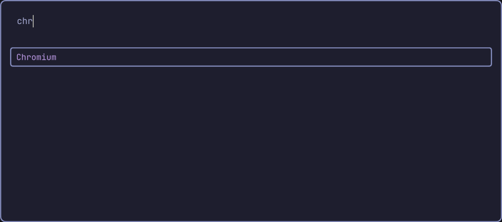
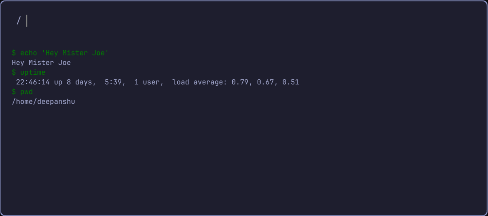

# Peppy


Peppy is a light-weight, keyboard-driven, **cross platform application launcher** desinged for **Linux** and **macOS**. 
Inspired by
Built with performance and simplicity in mind, Peppy offers a fast way to open **GUI application** from a beautiful and minimal interface.

## Demo


## Features
- ⚡ **Lightning-fast fuzzy search** for installed apps
- ⌨️ **Full keyboard navigation** – `Enter`, `Esc`, `↑ ↓`, `Ctrl+C`, etc.
- 🚀 **Launch top result instantly** with `Enter`
- 📜 **Run shell commands/scripts** by prefixing input with `/`
  - e.g., `/neofetch`, `/./myscript.sh`, `/python3 myscript.py`
- 🧠 **Intelligent command handling** with subprocess
- 🧩 **Custom Script/external command integration** 
- 🖱️ **Smart focus management** for seamless typing
- 🎨 **Clean, customizable PyQt6 UI**
- 🐧 Linux and Mac os support
- 🛠️ **Modular and extensible** codebase

## Installation ->
### Prerequisites:
- Python 3.10 or later installed on your system
- Git installed for cloning the repository
- Pip 

### Install with a Single command:
```bash
curl -sSL https://raw.githubusercontent.com/Deepanshusharwan/peppy/main/build.sh | bash
```

### Manual Install:
1. **Clone the repo and cd into it**
```
git clone https://github.com/Deepanshusharwan/peppy.git
cd peppy
```
2. **Setup a virtual enviroment**
```
python -m venv .venv
source ./.venv/bin/activate
```
3. **Install the libraries**
```
pip install uv
uv pip install .
pip install pyinstaller
```

#### Note: Stop here and move to the Usage instructions if you simply want to run it as a script and not a binary

4. **For Linux** 
* Systemwide install
``` 
chmod +x linux_build.sh    
./linux_build.sh
```
* Only build the executable
```
pyinstaller --onedir --clean --strip \
  --optimize=1 \
  --name="peppy" \
  --windowed \
  --icon="peppy.svg" \
  src/main.py
```

4. **For Mac os**
* Systemwide install
``` 
chmod +x mac_build.sh
./mac_build.sh
```
* Only build the executable
```
pyinstaller --onedir --clean --strip \
  --optimize=1 \
  --name="peppy" \
  --windowed \
  --icon="peppy.svg" \
  src/main.py
```

## Usage ->
### Launching the program:
#### Case 1: systemwide install
* simply launch it from the terminal
```
peppy
```
#### Case 2: Only built the exec file and not installed.
``` 
./dist/peppy/peppy
```
#### Case 3: Run without building the app
``` 
python src/main.py
```

### Using Peppy:
* Launch the application


* Type an application name 


* Press enter to open the top app or manually go down to the name of the app you want to open or click it.

* typing anywhere will directly put the text in the searchbar

#### Use External scripts and commands:
* Put a '/' before running a command and press enter to run it. 

* The result will be displayed in a text box below the searchbar

* The text box gets cleared everytime you close the app
* Every command you type will be stored in the textbox



## File Tree structure
```
├─ .git
├─ .github
├─ .gitignore
├─ .idea
├─ .python-version
├─ .ropeproject
├─ .venv
├─ LICENSE
├─ PKGBUILD
├─ Pipfile
├─ Pipfile.lock
├─ README.md
├─ build.sh               # build and installation script for peppy
├─ extra_functs           # scripts with extra functionality for peppy
│   └─ search
├─ linux_build.sh         # build script for linux
├─ mac_build.sh           # build script for mac
├─ peppy.md
├─ peppy.svg              # peppy  icon image              
├─ pyinstaller_file_remover.sh      # remove pyinstaller files
├─ pyproject.toml
├─ refrence_ui            # reference ui files for peppy
│   ├─ main_window.ui
│   ├─ test_ui.py
│   └─ ui.py
├─ src                    
│   ├─ main.py            # main source file for peppy run it to run the program
│   ├─ ui                 # contains the ui classes
│   │   ├─ main_window.py
│   │   └─ widget.py
│   └─ utils               # mostly backend functions and utilities
│       ├─ app_lister_lib  
│       │   ├─ __pycache__
│       │   │   └─ app_lister.cpython-313.pyc
│       │   ├─ app_lister.py
│       │   └─ mac
│       │       ├─ app_lister.go
│       │       ├─ app_lister.h
│       │       ├─ app_lister.so
│       │       ├─ go.mod
│       │       └─ test.py
│       └─ command_worker.py  # background process handler for external commands and scripts
└─ uv.lock
Total directories: 13
Total files: 45
```


## Planned Features

*  File search & preview
*  Theming (light/dark/custom)
*  Plugin/extension system
*  History & frequently used tracking
*  Integration with clipboard, browser bookmarks, system settings

## 🤝 Contributing
Pull requests are welcome! Feel free to fork this repo, open issues, and suggest enhancements.


## 📬 Author
**Deepanshu Sharwan** \
[Github](https://github.com/deepanshusharwan) | email: deepanshusharwan35@gmail.com